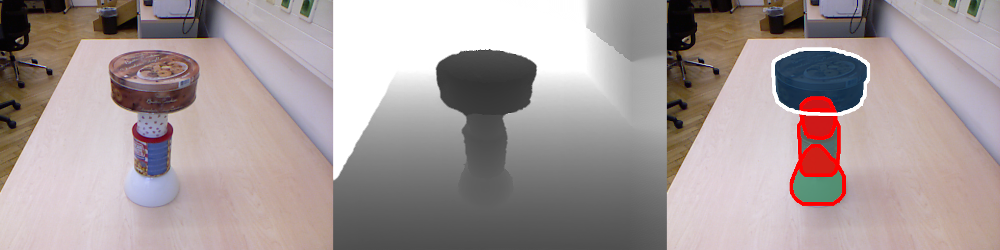

# Picking arm robot — grasp & segmentation

Vision stack for **autonomous bin picking**: amodal **instance segmentation**, **2D/3D grasp (suction) points**, and calibration data for arm-robot captures.

This repository is a **working fork**: your experiments and dataset layout live here; the core segmentation model follows the ICRA 2022 line of work (see **Upstream & citation** below). The GitHub front page is intentionally **your project**, not the original paper landing page.

## What’s in this tree

| Path | Purpose |
|------|---------|
| `sample_data/arm-robot-Dataset/arm_robot_images/` | Flat `IMG_*.png` top-down phone/camera captures |
| `sample_data/arm-robot-Dataset/custom_bop_bin_picking_dataset/` | BOP-style metadata: `camera.json`, `camera_extrinsics.json`, `objects/…` |
| `tools/run_with_centroids.py` | Segmentation + centroid / suction grasp pipeline |
| `tools/centroid_utils.py` | Grasp geometry (`suction`, `adaptive`, distance transform, …) |
| `docs/` | [QUICK_START](docs/QUICK_START.md), [CENTROID_COMPUTATION](docs/CENTROID_COMPUTATION.md), [PROJECT_PIPELINE](docs/PROJECT_PIPELINE.md), [LITERATURE_REVIEW](docs/LITERATURE_REVIEW.md) |

## Quick start (this fork)

1. **Environment** (GPU recommended): Python 3.8, PyTorch, CUDA-matched [Detectron2](https://detectron2.readthedocs.io/), then from repo root:

   ```bash
   pip install shapely torchfile opencv-python pyfastnoisesimd rapidfuzz termcolor tensorboard tqdm tabulate yacs matplotlib shapely
   python setup.py build develop
   ```

2. **Weights** (same as upstream): download from the [UOAIS Google Drive](https://drive.google.com/drive/folders/1D5hHFDtgd5RnX__55MmpfOAM83qdGYf0?usp=sharing), place `R50_*` checkpoints under `output/`, and `rgbd_fg.pth` under `foreground_segmentation/`.

3. **Run grasp + segmentation on one arm-robot frame** (adjust paths as needed):

   ```bash
   python tools/run_with_centroids.py \
     --config-file configs/R50_rgbdconcat_mlc_occatmask_hom_concat.yaml \
     --image-path ./sample_data/arm-robot-Dataset/arm_robot_images/IMG_1761.png \
     --camera-json ./sample_data/arm-robot-Dataset/custom_bop_bin_picking_dataset/camera.json \
     --use-dummy-depth \
     --output-dir ./output_centroids
   ```

   With real depth, pass `--depth-path …` and drop `--use-dummy-depth`. Optional: `--extrinsics-json`, `--save-json`, `--use-cgnet`.

4. **OSD-style batch** (original layout): `--dataset-path ./sample_data` with `image_color/` and `disparity/`.

## License & academic use

See [LICENSE.md](./LICENSE.md). Third-party notices (Detectron2, AdelaiDet, etc.) apply to bundled code.

If you use **the segmentation method** from the ICRA 2022 paper in research, cite it (BibTeX in the section below).

---

<details>
<summary><strong>Upstream & citation — ICRA 2022 amodal segmentation (UOAIS)</strong></summary>

**Authors:** Seunghyeok Back, Joosoon Lee, Taewon Kim, Sangjun Noh, Raeyoung Kang, Seongho Bak, Kyoobin Lee  

**Paper:** *Unseen Object Amodal Instance Segmentation via Hierarchical Occlusion Modeling* (ICRA 2022)  
[[Paper]](https://ieeexplore.ieee.org/abstract/document/9811646) [[arXiv]](https://arxiv.org/abs/2109.11103) [[Project]](https://sites.google.com/view/uoais) [[Video]](https://youtu.be/rDTmXu6BhIU)

<p align="center"></p>

### Original changelog
- [x] (2021.09.26) Segmentation codebase released  
- [x] (2021.11.15) Kinect Azure + OSD inference  
- [x] (2021.11.22) ROS (RealSense D435, Kinect)  
- [x] (2021.12.22) Train/eval on OSD & OCID + OSD-annot.

### Environment (upstream)
Tested with Python 3.7–3.8, PyTorch 1.8–1.9, torchvision 0.9.x, CUDA 10.2 / 11.1, Detectron2 v0.5 / v0.6.

```bash
git clone https://github.com/gist-ailab/uoais.git
cd uoais
mkdir output
# checkpoints → output/ ; rgbd_fg.pth → foreground_segmentation/
conda create -n uoais python=3.8
conda activate uoais
pip install torch torchvision
pip install shapely torchfile opencv-python pyfastnoisesimd rapidfuzz termcolor
# Install Detectron2 for your CUDA build, then:
python setup.py build develop
```

### Run on sample OSD layout

<p align="center"></p>

```bash
# RGB-D + CG-Net
python tools/run_on_OSD.py --use-cgnet --dataset-path ./sample_data --config-file configs/R50_rgbdconcat_mlc_occatmask_hom_concat.yaml
# Depth + CG-Net
python tools/run_on_OSD.py --use-cgnet --dataset-path ./sample_data --config-file configs/R50_depth_mlc_occatmask_hom_concat.yaml
# RGB-D only
python tools/run_on_OSD.py --dataset-path ./sample_data --config-file configs/R50_rgbdconcat_mlc_occatmask_hom_concat.yaml
# Depth only
python tools/run_on_OSD.py --dataset-path ./sample_data --config-file configs/R50_depth_mlc_occatmask_hom_concat.yaml
```

### ROS
**RealSense D435:** `roslaunch realsense2_camera rs_aligned_depth.launch` then `roslaunch uoais uoais_rs_d435.launch` or `rosrun uoais uoais_node.py _mode:="topic"`.  

**Azure Kinect:** `roslaunch azure_kinect_ros_driver driver.launch` then `roslaunch uoais uoais_k4a.launch`.  

Topics: `/uoais/vis_img`, `/uoais/results`, service `/get_uoais_results`.

### Demos without ROS
`tools/rs_demo.py` and `tools/k4a_demo.py` with the same `configs/*.yaml` and optional `--use-cgnet`.

### Train & evaluation
Download `UOAIS-Sim`, OSD, OCID per [GDrive](https://drive.google.com/drive/folders/1D5hHFDtgd5RnX__55MmpfOAM83qdGYf0?usp=sharing) and dataset links in the original project README; then `python train_net.py --config-file …`, `eval/eval_on_OSD.py`, `eval/eval_on_OCID.py`.

### Acknowledgments (upstream)
- [Detectron2](https://github.com/facebookresearch/detectron2), [AdelaiDet](https://github.com/aim-uofa/AdelaiDet)  
- [UCN](https://github.com/NVlabs/UnseenObjectClustering), [VRSP-Net](https://github.com/YutingXiao/Amodal-Segmentation-Based-on-Visible-Region-Segmentation-and-Shape-Prior)  
- [BlenderProc](https://github.com/DLR-RM/BlenderProc)

### BibTeX
```bibtex
@inproceedings{back2022unseen,
  title={Unseen object amodal instance segmentation via hierarchical occlusion modeling},
  author={Back, Seunghyeok and Lee, Joosoon and Kim, Taewon and Noh, Sangjun and Kang, Raeyoung and Bak, Seongho and Lee, Kyoobin},
  booktitle={2022 International Conference on Robotics and Automation (ICRA)},
  pages={5085--5092},
  year={2022},
  organization={IEEE}
}
```

</details>
